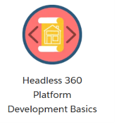
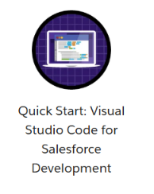
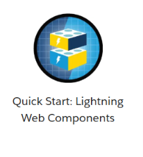
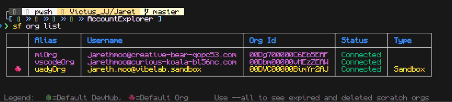
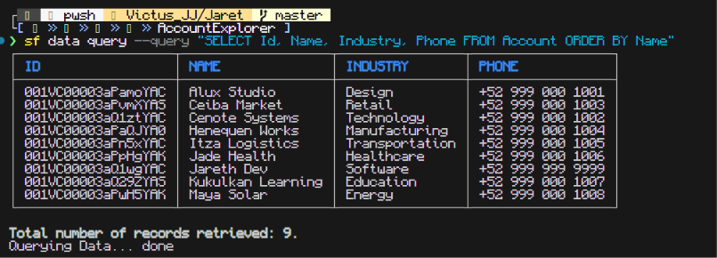
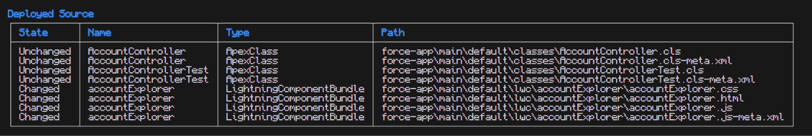
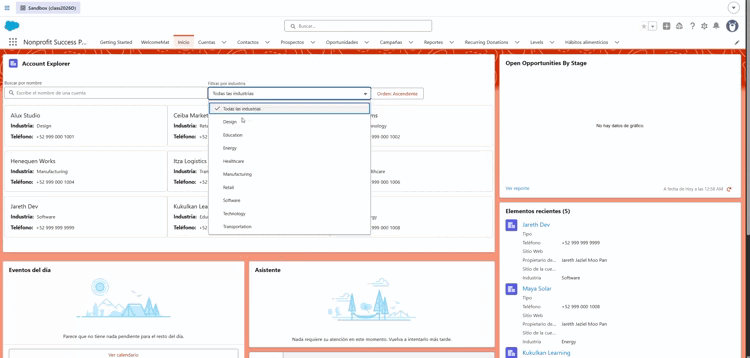
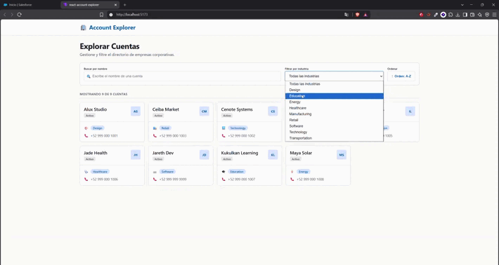

# Evidencias de Entrega — Account Explorer

> **Professional Readiness Sprint**  
> **Estudiante:** Jareth Jaziel Moo Pan  
> **Proyecto:** Account Explorer (Salesforce LWC + React Vite)

---

## 📋 Lista de Verificación de Requisitos (Evidence Checklist)

- [ ] **1. Public Trailhead profile or completion screenshots for all three assignments.**
- [ ] **2. Individual repository or source submission with Salesforce and React work.**
- [ ] **3. README with installation and run instructions for both applications.**
- [ ] **4. Screenshots or links showing the connected org, Account query, deployment, and LWC.**
- [ ] **5. React evidence showing local operation with `Account_Sample_Data.json`.**
- [ ] **6. Short AI work log: tool, important prompt, problem, and verification or correction.**

---

## 1. Perfil de Trailhead / Capturas de Finalización (Trailhead Profile & Assignments)

> **Requisito:** *Public Trailhead profile or completion screenshots for all three assignments.*

### Enlace al Perfil Público
- 🔗 **Perfil de Trailhead:** [https://www.salesforce.com/trailblazer/nuhbgukw0lde5v0vqe](https://www.salesforce.com/trailblazer/nuhbgukw0lde5v0vqe)

### Capturas de Pantalla de las Asignaciones / Módulos Completados

#### Asignación 1: Fundamentos / Apex / LWC

*Descripción: Captura donde se visualiza la finalización del módulo/proyecto 1.*

#### Asignación 2: Lightning Web Components / Integración

*Descripción: Captura donde se visualiza la finalización del módulo/proyecto 2.*

#### Asignación 3: Desarrollo Front-End / Proyecto Integral

*Descripción: Captura donde se visualiza la finalización del módulo/proyecto 3.*

---

## 2. Repositorio Individual y Código Fuente (Source Submission)

> **Requisito:** *Individual repository or source submission with Salesforce and React work.*

- 🔗 **Repositorio GitHub:** [https://github.com/JarethJaziel/uadyOrgSF](https://github.com/JarethJaziel/uadyOrgSF)
- 📂 **Código Salesforce DX (Apex + LWC):** [`../force-app/main/default/`](../force-app/main/default/)
  - Controlador Apex: [`AccountController.cls`](../force-app/main/default/classes/AccountController.cls)
  - Pruebas Apex: [`AccountControllerTest.cls`](../force-app/main/default/classes/AccountControllerTest.cls)
  - Lightning Web Component: [`accountExplorer/`](../force-app/main/default/lwc/accountExplorer/)
- 📂 **Código React SPA (Vite):** [`../react-account-explorer/`](../react-account-explorer/)
  - Componente Principal: [`App.jsx`](../react-account-explorer/src/App.jsx)
  - Tarjeta de Cuenta: [`AccountCard.jsx`](../react-account-explorer/src/AccountCard.jsx)
  - Datos Estáticos: [`Account_Sample_Data.json`](../react-account-explorer/src/Account_Sample_Data.json)

---

## 3. Documentación e Instrucciones de Instalación (README)

> **Requisito:** *README with installation and run instructions for both applications.*

- 📄 **Documento Principal:** [`README.md`](../README.md)
- **Contenido verificado en el README:**
  - ✅ Requisitos previos (Node.js, npm/pnpm, Salesforce CLI `sf`, VS Code, Org de desarrollo).
  - ✅ Estructura completa y detallada del repositorio unificado.
  - ✅ Guía paso a paso para Salesforce (autenticación `sf org login web`, despliegue `sf project deploy start`, consulta SOQL de prueba y configuración en Lightning App Builder).
  - ✅ Guía paso a paso para React (`pnpm install`, `pnpm run dev`, scripts disponibles y explicación del consumo de datos estáticos offline).

---

## 4. Evidencias de Salesforce (Org, SOQL, Deployment & LWC)

> **Requisito:** *Screenshots or links showing the connected org, Account query, deployment, and LWC.*

### 4.1 Org Conectada (`sf org display` / `sf org list`)
*Muestra la conexión exitosa entre el CLI y la Developer Edition / Scratch Org activa.*


```bash
# Comando de verificación ejecutado:
sf org display
```

### 4.2 Consulta SOQL de Cuentas (`sf data query`)
*Demuestra que el objeto `Account` devuelve los registros requeridos (`Id`, `Name`, `Industry`, `Phone`).*


```bash
# Comando ejecutado:
sf data query --query "SELECT Id, Name, Industry, Phone FROM Account ORDER BY Name"
```

### 4.3 Despliegue Exitoso del Código Fuente (`sf project deploy start`)
*Muestra el despliegue sin errores de las clases Apex y el componente LWC a la org.*


```bash
# Comando ejecutado:
sf project deploy start --source-dir force-app
```

### 4.4 Componente LWC en Lightning App Builder / Lightning Experience
*Muestra el componente `accountExplorer` funcionando en una página Lightning con búsqueda, filtro por industria y lista de cuentas.*



---

## 5. Evidencias de React Local (Local Operation & Static Data)

> **Requisito:** *React evidence showing local operation with `Account_Sample_Data.json`.*

### 5.1 Aplicación en Ejecución Local (`pnpm run dev` en `localhost:5173`)
*Muestra la aplicación React cargando los datos estáticos desde `src/Account_Sample_Data.json` sin realizar llamadas de red ni depender de APIs externas.*


---

## 6. Bitácora de Uso de IA (AI Work Log)

> **Requisito:** *Short AI work log: tool, important prompt, problem, and verification or correction.*

- 📄 **Bitácora Completa Detallada:** [`AI_WORK_LOG.md`](../AI_WORK_LOG.md)

### Resumen Sintético de Intervenciones con IA

| Herramienta | Prompt Clave / Fase | Problema / Desafío Detectado | Verificación / Corrección Manual Realizada |
|---|---|---|---|
| **Agentforce Vibes (Claude)** | Generación del controlador Apex `AccountController` con consulta SOQL de cuentas. | La primera versión no aplicaba seguridad a nivel de objeto/campo (`WITH USER_MODE`) ni manejaba excepciones con `AuraHandledException`. | Se añadió `WITH USER_MODE`, bloque `try/catch` con `AuraHandledException` y se validó desplegando a la org y consultando con `sf data query`. |
| **Agentforce Vibes (Claude)** | Generación de pruebas unitarias `AccountControllerTest`. | Las pruebas iniciales no creaban datos propios y dependían de registros preexistentes en la org. | Se creó `@testSetup` con inserción de cuentas de prueba y aserciones completas. Verificado con `sf apex run test` (>75% cobertura). |
| **ChatGPT** | Creación del componente LWC `accountExplorer` (JS + HTML + XML). | Faltaban atributos `isExposed` y `targets` en el `.js-meta.xml`, y el manejo de errores mostraba `[object Object]`. | Se completó la configuración XML para Lightning Pages y se añadió función reductora de errores. Probado en Lightning App Builder. |
| **Claude** | Componente React `App.jsx` con lógica de filtrado y consumo de JSON estático. | Los filtros provocaban recálculos excesivos y la ruta de importación de `Account_Sample_Data.json` era errónea. | Se refactorizó con `useMemo`, se corrigió el `import` directo del JSON local y se validó en `pnpm run dev`. |
| **Agentforce Vibes (Claude)** | Redacción de documentación técnica `README.md` unificada. | Discrepancias en comandos de Salesforce CLI (`sf` vs `sfdx`) y versiones de dependencias. | Se cotejaron y corrigieron todos los comandos contra la versión real instalada y la estructura del proyecto. |
